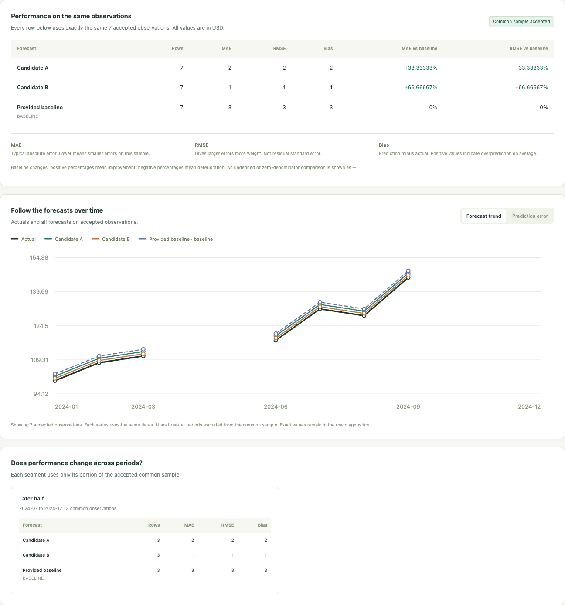

# Forecast Review Workbench

[中文使用指南](docs/QUICKSTART.zh-CN.md)

A local browser workbench with three usable tools: **train monthly regression candidates, review forecast files, and reconcile financial result rows with additive totals**. Bring CSV/XLSX files, map their columns, inspect failures and coverage, and download an offline evidence bundle.

| Open from the navigation | What you bring | What you get |
| --- | --- | --- |
| **Training experiments** | Monthly actuals and one to five raw feature columns | All single/pair OLS candidates, two baselines, forward development folds, a fixed development selection and explicit holdout evaluation |
| **Forecast review** | Actuals, one to five prediction files and an optional supplied baseline | Common-sample MAE/RMSE/bias, coverage gaps, row diagnostics and source-bound manual opinions |
| **Financial reconciliation** | Reference/challenger result files and optional reported totals | Exact row differences, dimension-safe additive groups, raw-vs-reported total checks and retained manual opinions |

The application reads CSV and value-only Excel files. Files travel only between your browser and a Python process on this computer; there is no external upload, account, API key, telemetry or runtime data download.



The original file-review workflow remains available. Version 0.2 adds executable candidate production and layered reconciliation. [Verification record](docs/VALIDATION.md) · [Recorded local evidence](docs/local-verification.json).

## Open the tool

Python 3.10 or newer. From this checkout:

```sh
python3 -m venv .venv
source .venv/bin/activate
python -m pip install .
forecast-review
```

The browser opens automatically. On macOS, `start.command` performs the first local setup and opens the installed tool; first installation can require internet access for Python packages. Subsequent use runs offline. After updating the source, reinstall with `python -m pip install .`.

## Train candidates and review the holdout

Select **Training experiments**. Choose a CSV or an Excel sheet/header, map a monthly date and target, and declare one to five raw features with their lags and release delays. Set the development end, forecast horizon and forward validation windows. Prepare development results before explicitly revealing the holdout.

Every attempted candidate and failure remains visible. With five features, that means 15 OLS candidates and two baselines. Scaling uses each training window only; selection uses pooled development MAE. Holdout scores cannot change that selection. Missing feature observations remove the same affected target months for all candidates and baselines. Missing targets, malformed numbers and ambiguous monthly calendars stop the experiment with an explanation.

Download the experiment ZIP, or explicitly transfer up to five successful models and one baseline into **Forecast review**. Transfer preserves the holdout's full expected range and does not accept its common sample for you. An alternative model transferred after reveal is marked as an exploratory comparison. All attempted candidates remain in the experiment evidence.

The numerical kernel is reused byte-for-byte from the author's public [Model Risk Lab](https://github.com/zheyuliu328/model-risk-lab), with a source commit and checksum in [the provenance record](src/forecast_review_workbench/_vendor/provenance.json). [Protocol and API](docs/EXTENSION_CONTRACT.md) · [Producer method](https://github.com/zheyuliu328/model-risk-lab/blob/main/docs/FORECAST_METHOD.md).

[View the actual training interface](docs/images/training.png).

## Review your existing forecast files

1. Select your actual-values file and candidate prediction files. Choose the Excel sheet and header row, then map date, value and optional entity columns. Headers can differ between files.
2. Declare the inclusive evaluation range, frequency, target, unit, forecast horizon and target transformation. Entity-based data require an explicit list of expected entities.
   The mapped dates are target periods; horizon does not shift them.
3. Review missing, duplicate, invalid and out-of-range records. Conflicting definitions block numerical comparison. Missing values are never filled with zero.
4. Explicitly accept the available common sample. MAE, RMSE and signed bias then use exactly the same valid keys for every candidate and the optional baseline.
5. Inspect the plot, period segments and row diagnostics, add a manual decision with its reasoning, and download the ZIP. Extract it and open `report.html` without the application.

Changing inputs, mappings, definitions, source declarations or sample acceptance invalidates old review notes. Downloading recomputes the review and refuses stale notes.

## Try the coverage trap

The optional **Explore an example** uses newly invented files with 12 expected months: candidate A covers nine, candidate B covers ten, and only seven are shared. A appears better on its own easier sample; B has lower error on the common seven months. All five excluded months remain visible. These are deliberately constructed forecasts, not fitted model results.

The tool does not depend on this fixture: the same file pickers and mappings accept external CSV/XLSX. [Example files](examples) can also be selected manually.

## Reconcile financial results

Select **Financial reconciliation**, then choose reference and challenger CSV/XLSX files. Map record ID, date, measure, risk type, tenor, currency, unit and value; a constant date/measure/unit declaration can replace a repeated column. IDs are exact text, including leading zeros. Set absolute tolerance and relative tolerance as a ratio. A row passes when `abs(challenger-reference) <= abs_tol + rel_tol*abs(reference)`.

Explicitly declare additivity to compare fixed date/measure/risk/tenor/currency/unit groups and optionally load each side's reported totals. A net match never clears member-row breaches. Reported totals are checked against their own raw rows and have their own top-level attention alert. The example includes offsetting +10/-10 row differences and an incorrect reported total.

Search and page through row/group/total details, add a reason for an accepted difference or missing evidence, then export. An opinion never changes the calculated status. Expected identities are the union of the supplied files; this cannot detect a record absent from both sources.

[View the reported-total attention example](docs/images/reconciliation.png).

## Evidence and automation

The export includes readable HTML, common-sample metrics, every expected row, every mapped input row, issues, exact JSON, declarations, manual notes and SHA-256 fingerprints. CSV text is escaped against spreadsheet formula execution; JSON retains exact selected values. Original files are never changed.

For a reproducible command-line example:

```sh
forecast-review --example --output /tmp/forecast-review-new
```

For your own saved settings, use `forecast-review --review request.json --output /path/to/new-directory`. File objects can use `{"path": "actual.csv"}` relative to the settings file. [The input contract](docs/CONTRACT.md) documents mappings and declarations. Existing output paths are refused; a complete bundle publishes atomically. Exit 0 means a common-sample comparison was computed, 1 means a pending review was exported, and 2 means execution failed. No exit code approves a model.

New workflow ZIPs include `request.json` with selected file snapshots, complete results, every attempted candidate or identity, source hashes, a manifest and offline HTML. Replay a request from the corresponding workflow with:

```sh
forecast-review --experiment request.json --output /path/to/new-development
forecast-review --experiment request.json --reveal-holdout --output /path/to/new-holdout
forecast-review --reconcile request.json --output /path/to/new-reconciliation
```

Exit 1 exports evidence needing attention: no eligible OLS candidate/holdout score, or any reconciliation layer needing attention. Manual opinions are added and exported in the GUI; replay does not invent them. These bundles contain supplied input values and file snapshots, so handle them like the source files.

## Scope

- Forecast-file review supports daily, monthly or quarterly keys and optional exact text entity IDs. Candidate training supports one continuous monthly target, one horizon and up to five declared features.
- Values must already occupy the declared target space. The tool does not infer Excel formula freshness, convert units, invert transformations, calculate nonlinear margin or implement a proprietary pricing engine.
- A supplied prediction file cannot establish that training was independent, free of leakage, or untouched by holdout inspection. Source definitions and manual opinions remain caller declarations.
- Available-sample metrics are diagnostic only. Coverage gaps restrict the meaning of the common-sample conclusion, even when its error is small.
- The local server binds to loopback only. It is a personal desktop tool, not a network deployment or multiuser service.

An independent project by Zheyu Liu, implemented with AI assistance and explicit reviewable checks. All bundled examples are newly invented. No employer/client code, templates, business data or private history are included. [Methods and source declaration](docs/DATA_AND_METHODS.md) · [Verification record](docs/VALIDATION.md).

## Development

```sh
python -m pip install '.[dev]'
python -m pytest
python -m ruff check src tests
python -m ruff format --check src tests
python -m build --wheel
```

The [browser acceptance check](docs/VALIDATION.md) uses real CSV/Excel file selection, downloads and independently recomputes the evidence, and checks desktop/narrow layouts. Node is needed for development browser tests only.

MIT licensed.
