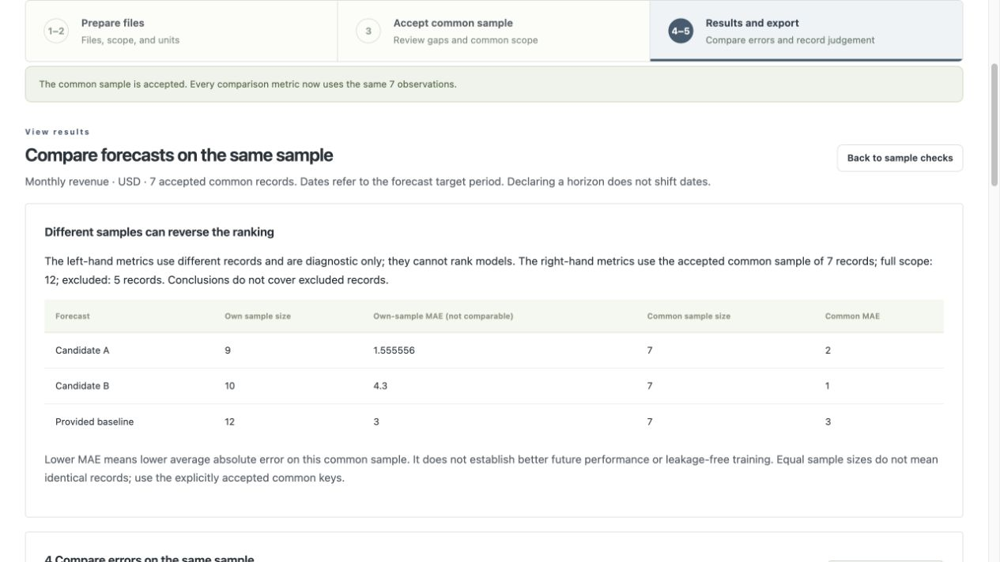
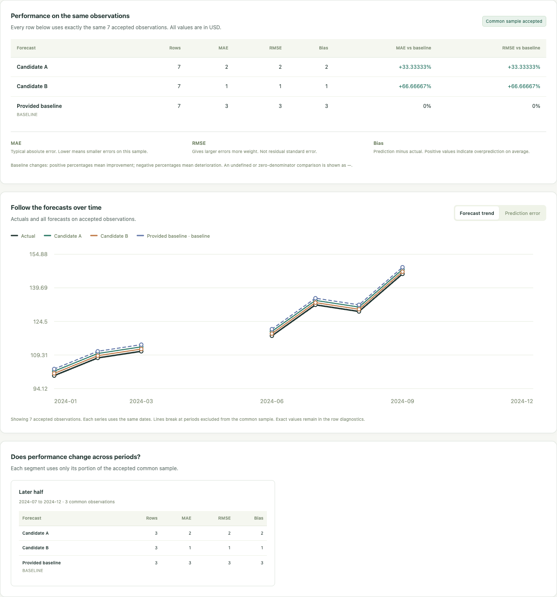

# Forecast Review Workbench

[Open the public website](https://forecast-review-zheyuliu.mystic-pear-2111.chatgpt.site) · [Tools and status](https://forecast-review-zheyuliu.mystic-pear-2111.chatgpt.site/tools.html) · [Quick start](docs/QUICKSTART.md)

Compare existing forecast files on the same observations. Declare the full expected scope, inspect missing records, explicitly accept a common sample, and download an offline report that another reviewer can check.

## Complete a first review

1. Open the website and select **Try an example**, or select actuals and prediction CSV/XLSX files.
2. Check column mappings and declare target, unit, horizon and expected periods.
3. Inspect excluded records and explicitly accept the common sample.
4. Compare MAE, RMSE and bias on identical observations.
5. Download the report bundle and open `report.html` offline.

The invented example reverses a misleading ranking: A looks better on its own sample (MAE 1.5556 vs B 4.3), but B is better on the seven shared months (MAE 1 vs A 2). Five excluded months remain outside the conclusion. A smaller MAE does not prove future skill or leakage-free training.



[Readable example report](docs/sample-review/report.html) · [Complete example bundle](docs/sample-review.zip) · [Example result](docs/sample-result.json) · [Current release](docs/RELEASE_2026-09-30.md) · [Human acceptance tasks](docs/HUMAN_ACCEPTANCE.md)

Training experiments and additive financial reconciliation are available under **Other tasks**. They are secondary workflows; forecast-file comparison is the default entry.

The public website processes CSV and value-only Excel inside a browser Worker; selected files are not uploaded. It needs no account or API key. The first calculation downloads about 17 MB of self-hosted components. Each file is limited to 10 MiB, 10,000 data rows and 100 columns; combined requests are capped at 40 MiB and tasks stop after two minutes. The separately installed desktop application sends files only to its loopback Python process.

Version 0.3 adds a file-first interface, browser-only execution for all three workflows, cancel/error recovery and a shared public tool-status page. External human first-use and repeat-use evidence remains unverified.



The original file-review workflow remains available. Version 0.2 adds executable candidate production and layered reconciliation. [Verification record](docs/VALIDATION.md) · [Recorded local evidence](docs/local-verification.json).

## Open the tool

[Open the public website](https://forecast-review-zheyuliu.mystic-pear-2111.chatgpt.site) and compare forecast files, or click **Try an example**. No installation is needed. For an offline desktop installation instead:

Python 3.10 or newer. From this checkout:

```sh
python3 -m venv .venv
source .venv/bin/activate
python -m pip install .
forecast-review
```

The browser opens automatically. On macOS, `start.command` performs the first local setup and opens the installed tool; first installation can require internet access for Python packages. Subsequent use runs offline. After updating the source, reinstall with `python -m pip install .`.

## Review your existing forecast files

1. Select your actual-values file and candidate prediction files. Choose the Excel sheet and header row, then map date, value and optional entity columns. Headers can differ between files.
2. Declare the inclusive evaluation range, frequency, target, unit, forecast horizon and target transformation. Entity-based data require an explicit list of expected entities.
   The mapped dates are target periods; horizon does not shift them.
3. Review missing, duplicate, invalid and out-of-range records. Conflicting definitions block numerical comparison. Missing values are never filled with zero.
4. Explicitly accept the available common sample. MAE, RMSE and signed bias then use exactly the same valid keys for every candidate and the optional baseline.
5. Inspect the plot, period segments and row diagnostics, add a manual decision with its reasoning, and download the ZIP. Extract it and open `report.html` without the application.

Changing inputs, mappings, definitions, source declarations or sample acceptance invalidates old review notes. Downloading recomputes the review and refuses stale notes.

## Try the coverage trap

The optional **Try an example** uses newly invented files with 12 expected months: candidate A covers nine, candidate B covers ten, and only seven are shared. A appears better on its own easier sample; B has lower error on the common seven months. All five excluded months remain visible. These are deliberately constructed forecasts, not fitted model results.

The tool does not depend on this fixture: the same file pickers and mappings accept external CSV/XLSX. [Example files](examples) can also be selected manually.

## Replay a received report from original files

The installed Python tool can now replay a downloaded forecast-review ZIP (schema 1 or 2), including browser exports. This is a local command, not a new website control. Obtain the original CSV/XLSX files separately; the ZIP does not embed them. Keep its `config.json` source IDs, and create a `sources.json` beside your files:

```json
{
  "schema_version": 1,
  "sources": {
    "actual": {"path": "actual.csv"},
    "model-a": {"path": "candidate-a.csv"},
    "model-b": {"path": "candidate-b.csv"},
    "baseline": {"path": "baseline.csv"}
  }
}
```

Use exactly the IDs present in that report. Paths are relative to `sources.json`; filenames may change because identification uses source IDs and original byte hashes. Sheet, header, mappings, scope, contracts and common-sample acceptance are restored from the report, without accepting any new sample.

```sh
python -m forecast_review_workbench.replay received-report.zip --sources sources.json --output replayed-review
```

Open `replayed-review/report.html` and inspect `replay-verification.json`. Exit 0 means the supplied original bytes reproduced all calculation/report artifacts; exit 1 preserves a recomputed report and lists differences; exit 2 means input/integrity validation failed. Existing output directories are refused. The original ZIP and files are read-only. Each source is limited to 10 MiB, combined sources to 40 MiB, and the ZIP to 50 MiB compressed/expanded and 100 members; no archive entries are extracted.

The verification records both archived and installed code hashes. Archived browser build metadata is preserved as provenance; the new run explicitly records its native Python environment. Unknown extra artifacts are reported as differences. This uses the installed engine, so reproduction is not independent numerical validation, source authentication, or evidence of leakage-free training. An unaccepted or conflicting report can reproduce exactly while still having no valid comparison. Legacy bundles without an explicit schema version, training/reconciliation bundles and event-probability bundles are not supported by this command.

## Train candidates and review the holdout

Select **Training experiments**. Choose a CSV or an Excel sheet/header, map a monthly date and target, and declare one to five raw features with their lags and release delays. Set the development end, forecast horizon and forward validation windows. Prepare development results before explicitly revealing the holdout.

Every attempted candidate and failure remains visible. With five features, that means 15 OLS candidates and two baselines. Scaling uses each training window only; selection uses pooled development MAE. Holdout scores cannot change that selection. Missing feature observations remove the same affected target months for all candidates and baselines. Missing targets, malformed numbers and ambiguous monthly calendars stop the experiment with an explanation.

Download the experiment ZIP, or explicitly transfer up to five successful models and one baseline into **Forecast review**. Transfer preserves the holdout's full expected range and does not accept its common sample for you. An alternative model transferred after reveal is marked as an exploratory comparison. All attempted candidates remain in the experiment evidence.

The numerical kernel is reused byte-for-byte from the author's public [Model Risk Lab](https://github.com/zheyuliu328/model-risk-lab), with a source commit and checksum in [the provenance record](src/forecast_review_workbench/_vendor/provenance.json). [Protocol and API](docs/EXTENSION_CONTRACT.md) · [Producer method](https://github.com/zheyuliu328/model-risk-lab/blob/main/docs/FORECAST_METHOD.md).

[View the actual training interface](docs/images/training.png).

## Reconcile financial results

Select **Financial reconciliation**, then choose reference and challenger CSV/XLSX files. Map record ID, date, measure, risk type, tenor, currency, unit and value; a constant date/measure/unit declaration can replace a repeated column. IDs are exact text, including leading zeros. Set absolute tolerance and relative tolerance as a ratio. A row passes when `abs(challenger-reference) <= abs_tol + rel_tol*abs(reference)`.

Explicitly declare additivity to compare fixed date/measure/risk/tenor/currency/unit groups and optionally load each side's reported totals. A net match never clears member-row breaches. Reported totals are checked against their own raw rows and have their own top-level attention alert. The example includes offsetting +10/-10 row differences and an incorrect reported total.

Search and page through row/group/total details, add a reason for an accepted difference or missing evidence, then export. An opinion never changes the calculated status. Expected identities are the union of the supplied files; this cannot detect a record absent from both sources.

[View the reported-total attention example](docs/images/reconciliation.png).

## Evidence and automation

The export includes readable HTML, common-sample metrics, every expected row, every mapped input row, issues, exact JSON, declarations, manual notes and SHA-256 fingerprints. CSV text is escaped against spreadsheet formula execution; JSON retains exact selected values. Original files are never changed.

For a reproducible command-line example:

```sh
forecast-review --example --output /tmp/forecast-review-new
```

For your own saved settings, use `forecast-review --review request.json --output /path/to/new-directory`. File objects can use `{"path": "actual.csv"}` relative to the settings file. [The input contract](docs/CONTRACT.md) documents mappings and declarations. Existing output paths are refused; a complete bundle publishes atomically. Exit 0 means a common-sample comparison was computed, 1 means a pending review was exported, and 2 means execution failed. No exit code approves a model.

New workflow ZIPs include `request.json` with selected file snapshots, complete results, every attempted candidate or identity, source hashes, a manifest and offline HTML. Replay a request from the corresponding workflow with:

```sh
forecast-review --experiment request.json --output /path/to/new-development
forecast-review --experiment request.json --reveal-holdout --output /path/to/new-holdout
forecast-review --reconcile request.json --output /path/to/new-reconciliation
```

Exit 1 exports evidence needing attention: no eligible OLS candidate/holdout score, or any reconciliation layer needing attention. Manual opinions are added and exported in the GUI; replay does not invent them. These bundles contain supplied input values and file snapshots, so handle them like the source files.

## Scope

- Forecast-file review supports daily, monthly or quarterly keys and optional exact text entity IDs. Candidate training supports one continuous monthly target, one horizon and up to five declared features.
- Values must already occupy the declared target space. The tool does not infer Excel formula freshness, convert units, invert transformations, calculate nonlinear margin or implement a proprietary pricing engine.
- A supplied prediction file cannot establish that training was independent, free of leakage, or untouched by holdout inspection. Source definitions and manual opinions remain caller declarations.
- Available-sample metrics are diagnostic only. Coverage gaps restrict the meaning of the common-sample conclusion, even when its error is small.
- The optional desktop server remains loopback-only. The public version is a static site running the same engines in the browser, not a multiuser data server.
- Experiment-to-review transfer temporarily uses session storage in the same tab and removes it when the destination reads it. Refreshing clears ordinary page state. Experiment and reconciliation ZIPs include full selected file snapshots (including unmapped columns and other sheets); forecast-review ZIPs include selected source values and hashes.
- Browser NumPy is pinned to its compatible WASM build; environment-aware experiment fingerprints need not equal desktop fingerprints. Review the dependencies recorded in each bundle.

An independent project by Zheyu Liu, implemented with AI assistance and explicit reviewable checks. All bundled examples are newly invented. No employer/client code, templates, business data or private history are included. [Methods and source declaration](docs/DATA_AND_METHODS.md) · [Verification record](docs/VALIDATION.md).

## Development

```sh
python -m pip install '.[dev]'
python -m pytest
python -m ruff check src tests
python -m ruff format --check src tests
python -m build --wheel
```

The [browser acceptance check](docs/VALIDATION.md) uses real CSV/Excel file selection, downloads and independently recomputes the evidence, and checks desktop/narrow layouts. Node is needed for public-site builds and development browser tests. Run `npm ci`, `npm run build:web`, then `npm run test:web`. Public builds copy only explicitly allowlisted assets, pin dependency hashes and include third-party licenses.

MIT licensed.

## Demonstrate a complete review

The default task is forecast-file comparison; training and reconciliation remain under Other tasks. The five-step guide leads from files and mappings through explicit common-sample acceptance to results and export. The result and offline report compare own-sample diagnostics with accepted common-sample MAE. [English walkthrough, three-minute introduction and technical questions](docs/WALKTHROUGH.md).

## Compare forecasts from different origins

The [rolling-origin review](docs/ROLLING_ORIGIN.md) keeps origin, target and horizon explicit, reports common-sample errors separately by horizon, and retains every excluded key. An original example shows one candidate leading at horizon 1 and another at horizon 2. Schema 1 remains supported. Use **Try the rolling-origin example** in the public browser, or follow the CLI instructions. Both paths export origin-preserving rows and per-horizon metrics.

### Entity and horizon diagnostics

The native review and offline report now split the accepted common sample by entity and horizon, including coverage and supplied-baseline MAE/RMSE gains. An original counterexample shows pooled improvement alongside 100% worse error for a smaller entity. [Run the task and read its limits](docs/ENTITY_HORIZON_REVIEW.md). The public browser provides entity search, horizon filtering and pagination; filters change the view while exports retain every group.

### Native event-probability review

Review fixed binary-event probabilities with explicit expected keys, label-availability dates and an evaluation cutoff. Brier/log loss use one accepted common sample, preserve pending and invalid rows, and report impossible probability endpoints without clipping. See [the original example and input contract](docs/EVENT_PROBABILITY_REVIEW.md). This optional task is not yet exposed in the public browser.
